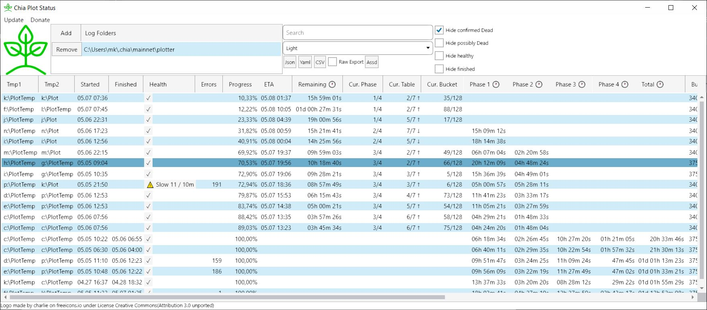

[](https://www.paypal.com/donate?hosted_button_id=PDLLVF5XVMJPC)
[](https://liberapay.com/grayfallstown/donate)

<p align="center">
  
</p>

# [Chia Plot Status](https://grayfallstown.github.io/Chia-Plot-Status/)

Tool to Monitor and Analyse Chia Plotting log files, show health and progress of running plots and estimated time to completion




## Features

 - Monitor Progress of running plots
 - Show estimated time to completion based on your already finished plots best matching your current plot config
 - Monitor Health of plot processes
 - Show important information from log file in easy to read table
 - Multiple folders with log files supported (multiple plotting rigs, anyone?)
 - Multiple plots per log file supported (plot create --num n)
 - Export of readable or raw data to Json, Yaml and CSV


## See Chia Plot Status in action:

### On Upside Down Crypto (YouTube):

<a href="http://www.youtube.com/watch?feature=player_embedded&v=lK0o3KyGFW8" target="_blank">
 
</a>


### On Patro TV (YouTube):

<a href="http://www.youtube.com/watch?feature=player_embedded&v=JLVhG86-4UI" target="_blank">
 
</a>

## How it works

Chia Plot Status observes the log folders you give it to monitor which can be local or connected via network. By this it supports monitoring multiple plotting rigs as you can access them on your desktop even if your plotting rigs are headless. It regulary checks for new Log files in those folders and analyses them.

On basis of finished plots it builds a local statistic (on your machine, no data is send anywhere or pulled from any cloud) and uses them to calculate ETA / time remaining and warning thresholds for the Health of your plotting processes.


## Working with many distributed plotting rigs

**Recommended way:** Use sshfs (with [sshfs-win](https://github.com/billziss-gh/sshfs-win) for Windows) to securely mount the log dirs of your plotting rigs on your desktop via highly encrypted network connection, where it is your desktop that initiates the mount. This can be set up so that the desktop can only access the log dirs and only has read access. Even if you use remote plotting rigs that you access over the internet this is the most secure way and you most likely access your remote servers via ssh already.

Other Options: Mount the log folders of all rigs as network shares (via samba on linux) if all your plotting rigs are in the local network or connected via VPN. Another way would be to make a cronjob on your plotting rigs that uses scp or rsync in append mode to copy the log dir to your desktop where you run Chia Plot Status, but if you can manage to set this up you should set up sshfs instead. Last, least preferred option: collect them with cloud apps like Google Drive (Chia Plot Status does not talk to any cloud services for you, you have to install those apps and mount your log folders in them yourself if you want to use them).


**Best Practice:**
- Only delete log files of finished plots if your hardware or the way you plot has significantly changed. Chia Plot Status uses finished plots to calculate ETA/Time Remaining as well as warning/error thresholds. If you delete finished log files the quality of those values decreases significantly.
- Use SSHFS to access the log directories of your plotting rigs
- Each plotting rig should have its own log folder, so they don't mix and mess up estimates and warning thresholds for each other.
- Always log locally. If you log directly to a network share / NAS your plotting processes will crash if the connection becomes flaky. Prefer connecting your host machine (which runs Chia Plot Status) to networkshares on the plotting rigs, not the other way around.


## Installation / Download


Windows: [Download latest version](https://github.com/grayfallstown/Chia-Plot-Status/releases/latest/download/Setup.exe)
You will get a blue warning saying this was published by an unknown developer.

Linux: First install [dotnet 5.0 SDK](https://dotnet.microsoft.com/download/dotnet/5.0), then either the Chia Plot Status [deb](https://github.com/grayfallstown/Chia-Plot-Status/releases/latest/download/ChiaPlotStatus.linux-x64.deb) or [rpm](https://github.com/grayfallstown/Chia-Plot-Status/releases/latest/download/ChiaPlotStatus.linux-x64.rpm) package depending on your linux distribution (deb for ubuntu)

For Mac you currently have to [build it yourself](#Build-it-yourself).

## Getting Log Files from PowerShell

```
$Temp1="D:\PlotTemp"
$Temp2="D:\PlotTemp"
...

chia.exe plots create --tmp_dir "$TEMP1" --tmp2_dir "$TEMP2" [and so on] 2>&1 | % ToString | Tee-Object -FilePath "C:\Users\$USERNAME\.chia\mainnet\plotter\$([GUID]::NewGUID().ToString('D')).log"
```

The last part with `2>&1 | % ToString | Tee-Object` writes the log to the PowerShell and to a file with a unique name for each plotting process.

You can download a [full example script with Tee-Object](https://gist.github.com/grayfallstown/8530acb84eb131d3dae074e4be23badb) as well.


## Need the columns in a different order?

See https://github.com/grayfallstown/Chia-Plot-Status/issues/36#issuecomment-843351280


## Troubleshooting

If you use Cloud Sync Services, rsync/scp cronjobs or tools like Syncthing to collect your log files you might run into an issue with the files not properly syncing. Sonething like `The process cannot access the file because it is being used by another process.`. See [Issue #40](https://github.com/grayfallstown/Chia-Plot-Status/issues/40#issuecomment-841025993) for how to fix that, or even better, use sshfs instead.

If Chia Plot Status does no longer start, try renaming `ChiaPlotStatu.config.json` to `ChiaPlotStatu.config.json.backup`. The file is located in your home directory at `C:\Users\<your username>\ChiaPlotStatu.config.json` on windows, `/home/<your username>/ChiaPlotStatu.config.json` on linux and `<your user profile directory>/ChiaPlotStatu.config.json` on mac.

## Custom tools / Home automation

You can export plot logs to json, yaml or csv both via the gui or the console for automation:

```
"C:\Program Files (x86)\ChiaPlotStatus\ChiaPlotStatus\ChiaPlotStatusCli.exe" --help
Copyright (C) 2021 grayfallstown

  -o, --outfile            Required. The file to write to

  -f, --format             Required. The format to use while writing the file. Valid values are json, yaml and csv

  -l, --log-folders        The folders where logs can be found, comma separated. Uses default folder when empty

  -s, --sort-property      The property you want the plotlogs sorted by

  -a, --sort-asc           Sort ascending

  --search                 Filter plotlogs by this search terms. You filter for your temp1 folder for example.

  --hide-finished          Hide finished plots

  --hide-possibly-dead     Hide possibly dead plots

  --hide-confirmed-dead    Hide confirmed dead plots

  --hide-healthy           Hide healthy plots

  --keep-updating          Keep updating the file every 10 seconds

  --help                   Display this help screen.


"C:\Program Files (x86)\ChiaPlotStatus\ChiaPlotStatus\ChiaPlotStatusCli.exe" -o test.json -f json
Sorting by Progress
File 'test.json' written
```

Note: Write your tools or home automation in a way that new fields/properties/columns added to the exported files do not crash it.


## Avalonia Incident

Chia Plot Status uses an external library to provide a graphical user interface that runs on Windows, Linux and MacOS called [AvaloniaUI](https://avaloniaui.net/). ~~Avalonia currently gets flagged as Trojan by Windows Defender~~ and as far as currently known, only by Windows Defender. The file was already [deemed safe by microsoft malware analysts](https://github.com/grayfallstown/Chia-Plot-Status/issues/50#issuecomment-842849470), but then got [flagged again](https://github.com/grayfallstown/Chia-Plot-Status/issues/50#issuecomment-843005699). ~~I am currently trying to resolve this issue, but feel free to postpone the installation of Chia Plot Status until the issue is resolved.~~

**UPDATE**: Users who have Chia Plot Status installed or tried to install it during that time were NOT in any danger. The files were safe and clean all along and falsely reported by Windows Defender. Windows Defender no longer reports Avalonia as a Trojan **IF** one updates the Dynamic Signatures of Windows Defender. For transparency I am leaving this notice for the time being and I have documented the entire situation in an [incident report](https://github.com/grayfallstown/Chia-Plot-Status/issues/2#issuecomment-843279417)


## Open Source

MIT opensource licence, free to keep or change.


## Build it yourself

Download and install [dotnet 5.0 SDK](https://dotnet.microsoft.com/download/dotnet/5.0) and [git](https://git-scm.com/).

On the console, clone/download this repository:

`git clone https://github.com/grayfallstown/Chia-Plot-Status.git`

Build it:

`cd Chia-Plot-Status`

`dotnet build --configuration .\ChiaPlotStatus.sln /p:Configuration=Release /p:Platform="Any CPU"`

Chia-Plot-Status can now be started with 

windows: `.\ChiaPlotStatusGUI\bin\Release\net5.0\ChiaPlotStatus.exe` 

linux: `./ChiaPlotStatusGUI/bin/Release/net5.0/ChiaPlotStatus`

macOS: `dotnet ./ChiaPlotStatusGUI/bin/Release/net5.0/ChiaPlotStatus.dll` (thanks @mahdi-ninja)

alternatively try `dotnet run --build`.


## Special Thanks

- [@charlie](https://freeicons.io/profile/740) on [freeicons.io](https://freeicons.io) for the Logo [(details)](https://github.com/grayfallstown/Chia-Plot-Status/blob/main/Logo/Icon%20-%20Readme.txt)
- @ใครๆก็ทําได้ DiY
- @Alpha One
- @Çağlar
- @Cuello
- @DazEB2
- @DjMuffin_top
- @Dujapan
- @Gridjump
- @@getchiaplot
- @Hellfall1
- @Jazeon
- @Jonesyj83
- @KJP Gaming
- @Lucky_Length2676
- @Lyushen
- @Manic!
- @Mr pq
- @Ok-Studio5311
- @Patro TV
- @R3htribution
- @RaySmalley
- @RedxLus
- @SERVAK
- @TormodSan
- @Upside Down Crypto
- @Waloumi
- @WeAreNotAngels
- @Worldly-Mind3108
- @Zubon102
- @badi95
- @bathrobehero
- @bestq8.com
- @buettgenbach
- @c-pool
- @carfnann
- @chiaxch
- @darkfriend77
- @djdookie81
- @dorofino
- @douwebusschops
- @dvlzgrmz
- @j.spracher
- @jimshank
- @jonnnny
- @kata32
- @littleneko
- @magnusmyklebost
- @massimo de rovere
- @mmoingame
- @ouoam
- @ozulu
- @puperinoo
- @raf-cr
- @revlisoft
- @rsegrest77
- @rul3s
- @sirdeekay
- @tajchert
- @whitetechnologies
- @Vera Toro
- @whoismos3s
- @wild9
- @wizbowes
- @z.ostroff
- @zeroarst
- @The Malware Analysts of Microsoft and Malwarebytes for checking Chia Plot Status after every false positive

For contributing to Chia Plot Status either by [donating](https://www.paypal.com/donate?hosted_button_id=PDLLVF5XVMJPC) or otherwise.
