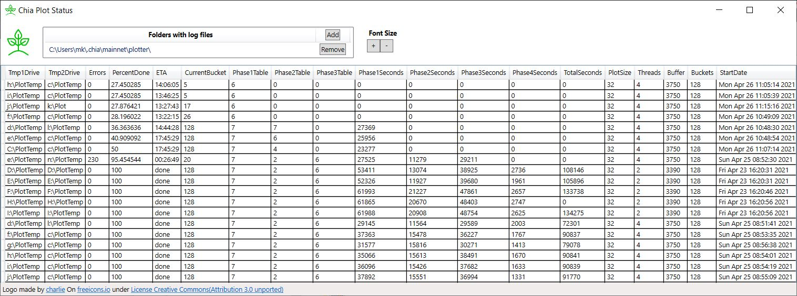
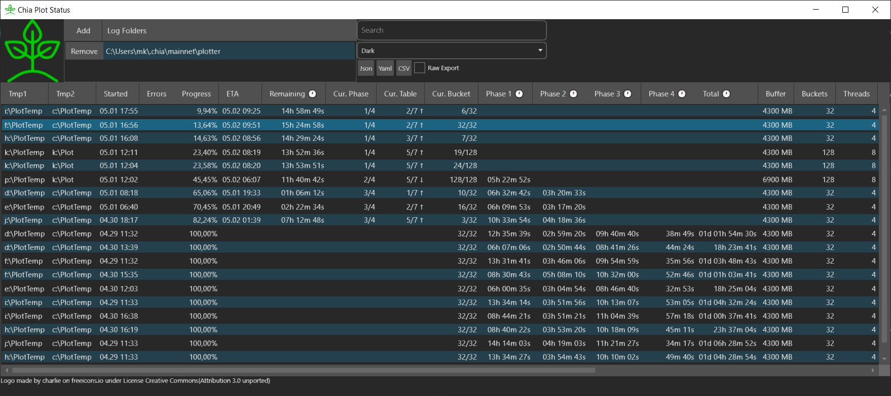

<p align="center">
  
</p>

# [Chia](https://www.chia.net/) Plot Status





## Features

 - Monitor Progress of running plots
 - Show estimated time to completion based on your already finished plots best matching your current plot config
 - Monitor Health of plot processes
 - Show important information from log file in easy to read table
 - Multiple folders with log files supported (multiple plotting rigs, anyone?)
 - Multiple plots per log file supported (plot create --num n)
 - Export of readable or raw data to Json, Yaml and CSV

## How it works

Chia Plot Status observes the log folders you give it to monitor which can be local, on a networkshare or mounted from a cloud app like Google Drive (Chia Plot Status does not talk to any cloud services for you, you have to install those apps and mount your log folders in them yourself if you want to use them). By this it supports monitoring multiple plotting rigs as you can access them via a networkshare or by similar means. It regulary checks for new Log files in those folders and analyses them.

On basis of finished plots it builds a local statistic (on your machine, no data is send anywhere or pulled from any cloud) and uses them to calculate ETA / time remaining and warning thresholds for the Health of your plotting processes.


## Installation / Download

Windows: [Download latest version smart-farmer](https://github.com/grayfallstown/Chia-Plot-Status/releases/download/0.9.7-beta3/Setup.exe)

You will get a blue warning saying this was published by an unknown developer.

For Mac and Linux you currently have to [build it yourself](#Build-it-yourself) for now.


## Getting Log Files from PowerShell

```
$BUCKETS=128
$THREADS=4
...

chia.exe plots create --tmp_dir "$TEMP1" --tmp2_dir "$TEMP2" --final_dir "$FINAL" --size 32 --buffer $BUFFER --num_threads $THREADS --buckets $BUCKETS --alt_fingerprint $FINGERPRINT --pool_public_key $PUBKEY | Tee-Object -FilePath "C:\Users\$USERNAME\.chia\mainnet\plotter\$([GUID]::NewGUID().ToString('D')).log"
```

## Working with many distributed plotting rigs

Either mount the log folders of all rigs as network shares or collect them by your favorite means like Google Drive or something similar (Chia Plot Status does not talk to any cloud services for you, you have to install those apps and mount your log folders in them yourself if you want to use them)

Best Practice:
- Each plotting rig should have its own log folder, so they don't mix and mess up estimates and warning thresholds for each other.
- Always log locally. If you log directly to a network share / NAS your plotting can crash if the connection becomes flaky. Prefer connecting your host machine to networkshares on the plotters, not the other way around or use your own cloud solutions which offer local folders (should be pretty much all of them).


## Custom tools / Home automation

You can export plot logs to json, yaml or csv both via the gui on the console or for automation:

```
"C:\Program Files (x86)\ChiaPlotStatus\ChiaPlotStatus\ChiaPlotStatusCli.exe" --help
Copyright (C) 2021 grayfallstown

  -o, --outfile            Required. The file to write to

  -f, --format             Required. The format to use while writing the file. Valid values are json, yaml and csv

  -l, --log-folders        The folders where logs can be found, comma separated. Uses default folder when empty

  -s, --sort-property      The property you want the plotlogs sorted by

  -a, --sort-asc           Sort ascending

  --search                 Filter plotlogs by this search terms. You filter for your temp1 folder for example.

  --hide-finished          Hide finished plots

  --hide-possibly-dead     Hide possibly dead plots

  --hide-confirmed-dead    Hide confirmed dead plots

  --hide-healthy           Hide healthy plots

  --keep-updating          Keep updating the file every 10 seconds

  --help                   Display this help screen.


"C:\Program Files (x86)\ChiaPlotStatus\ChiaPlotStatus\ChiaPlotStatusCli.exe" -o test.json -f json
Sorting by Progress
File 'test.json' written
```


## Open Source

MIT opensource licence, free to keep or change.

## Build it yourself

Download and install [dotnet 5.0 SDK](https://dotnet.microsoft.com/download/dotnet/5.0) and [git](https://git-scm.com/).

On the console, clone/download this repository:

`git clone https://github.com/grayfallstown/Chia-Plot-Status.git`

Build it:

`cd Chia-Plot-Status`

`dotnet build --configuration .\ChiaPlotStatus.sln /p:Configuration=Release /p:Platform="Any CPU"`

Chia-Plot-Status can now be found at 

windows: `.\ChiaPlotStatusGUI\bin\Release\net5.0\ChiaPlotStatus.exe` 

linux: `./ChiaPlotStatusGUI/bin/Release/net5.0/ChiaPlotStatus`

alternatively try `dotnet run --build`.

## Thanks to

[charlie](https://freeicons.io/profile/740) on [freeicons.io](https://freeicons.io) for the Logo [(details)](https://github.com/grayfallstown/Chia-Plot-Status/blob/main/Logo/Icon%20-%20Readme.txt)
